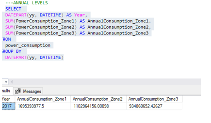

# MOROCCO ELECTRICITY COMSUMPTION ANALYSIS

## Introduction
This is an in-depth analysis of electricity consumption in Morocco, using Excel, SQL, and Power BI. The project examines data measured at 10-minute intervals across three zones, incorporating environmental factors such as temperature, humidity, and wind speed. The goal is to provide valuable insights that enhance effective and strategic electricity consumption planning and management.

### Brief Overview of the Project's Objective
This project aims to analyze electricity consumption patterns in Morocco. By understanding these patterns, we can enhance energy management, optimize resource allocation, and contribute to the sustainability and efficiency of the electrical grid.

### Data Source
The data for this analysis was sourced from [Maven Analytic](https://app.mavenanalytics.io/datasets). A reputable provider of high-quality datasets for business intelligence and data analysis. The dataset includes detailed measurements that are critical for understanding the impact of environmental factors on electricity consumption. 

### Importance of Understanding Electricity Consumption Patterns in Morocco
Understanding electricity consumption patterns is critical for several reasons:
- **Resource Optimization**: Helps in planning and distributing energy resources more effectively.
- **Demand Forecasting**: Aids in predicting future energy needs, allowing for better preparedness.
- **Cost Efficiency**: Reduces costs associated with overproduction or underproduction of electricity.
- **Sustainability**: Supports efforts to minimize environmental impacts by aligning consumption with renewable energy production.

### Data Dictionary 
This data dictionary provides detailed descriptions of the fields used in the dataset for analyzing electricity consumption and environmental factors. 

This table ensures clear and consistent understanding of the data fields utilized in our analysis.

### Data Description
The data used in this analysis consists of electricity consumption measurements from Morocco, recorded at 10-minute intervals across three distinct zones. The dataset includes environmental factors such as temperature, humidity, and wind speed. The data spans a significant period, providing granular insights necessary for detailed analysis.

### Methodology Overview
The analysis was conducted using a combination of SQL, Excel, and Power BI. These tools facilitated data extraction, transformation, and visualization to uncover meaningful patterns and insights.
1. **SQL**: Used for data querying, cleaning, and aggregation.
2. **Excel**: Utilized for initial data exploration, statistical analysis, and creating preliminary visualizations.
3. **Power BI**: Employed for advanced data visualization, dashboard creation, and interactive reporting.

By leveraging these tools, we can effectively analyze and visualize the electricity consumption patterns in Morocco, providing valuable insights for energy management and planning.

### Data Preparation and Exploration
#### Data Cleaning and Preprocessing
The initial step in our analysis involves cleaning and preprocessing the data to ensure its quality and reliability. This process includes:
1. **Handling Missing Values**: Identifying and imputing or removing missing data points to maintain data integrity.
2. **Outlier Detection**: Identifying and addressing outliers that could skew the analysis.
3. **Inconsistencies Resolution**: Correcting any inconsistencies in the data, such as incorrect timestamps or erroneous readings.

#### Data Transformation
To facilitate the analysis, we created several derived variables:
1. **Time of Day**: Categorizing consumption data into specific hours to analyze diurnal patterns.
2. **Day of Week**: Segmenting data by the day of the week to capture weekly trends.
3. **Month**: Classifying data by month to identify seasonal variations.

### Exploratory Data Analysis (EDA)
Exploratory Data Analysis was conducted to gain a preliminary understanding of the dataset. This included:

1. **Descriptive Statistics**: Calculating mean, median, standard deviation, and other summary statistics.
2. **Visualizations**: Creating histograms, box plots, and time series plots to visually inspect data distributions and trends.

#### Seasonal Patterns in Electricity Consumption

**Hourly Patterns**
- **Average Hourly Consumption by Season**: Analyzed to understand how consumption varies throughout the day in different seasons.

*SQL Code snippet for hourly consumption of electricity across the three (3) zones*

**Weekly Patterns**
- **Average Daily Consumption by Day of Week and Season**: Investigated to reveal how daily consumption differs across weekdays and weekends, and how these patterns shift with the seasons.
- **Load Profiles for Weekdays and Weekends**: Developed to compare consumption behaviors between weekdays and weekends.

*SQL Code snippet for Weekly consumption of electricity across the three (3) zones*

**Annual Patterns**
- **Monthly Consumption Patterns**: Explored to identify trends and anomalies in monthly energy use.
- **Year-Over-Year Comparisons**: Conducted to detect long-term changes and trends in electricity consumption.

*SQL Code snippet for Annual  consumption of electricity across the three (3) zones*

#### Correlation Analysis Using Excel
**Data Alignment**

To analyze the correlation between electricity consumption and environmental factors, we ensured proper data alignment for consumption and variables such as temperature, wind speed, and humidity. This step was crucial to maintain the integrity and accuracy of the analysis.

**Correlation Calculations**

We calculated the Pearson correlation coefficient to quantify the strength and direction of the relationship between electricity consumption and each environmental variable. The Pearson correlation coefficient is a widely used statistical measure that helps in understanding the degree of linear association between two variables. The correlation calculations reveals that the power consumption zone with the strongest relation is power consumption_zone3 = Temperature (0.489527308).

*Correlation calculation Table*
|      **Zone**      |      **Temperature**      |      **Humidity**      |      **Wind-Speed**      |      
:--------------------|---------------------------|------------------------|--------------------------:
|1|-0.440220789|-0.287420602|0.167444076|
|2| 0.382428106|-0.294961424|0.146413393|
|3| 0.489527308| 0.233021673|0.278640568|

**Analysis of Correlation Results**

The correlation results were analyzed to identify the strongest correlations and understand their potential implications. This analysis helps in determining which environmental factors most significantly impact electricity consumption, thereby providing insights for better energy management and planning. 

#### Comparative Analysis of consumption patterns
To investigate whether different zones exhibit distinct patterns in electricity consumption, a comprehensive analysis was conducted using Power BI. The following steps were taken:

1. **Data Preparation**: The datasets containing electricity consumption data for multiple zones was imported into Power BI. 

2. **Data Visualization**: Interactive visualizations, such as line charts and bar charts, were created to illustrate the electricity consumption patterns across different zones.

3. **Zone-wise Analysis**: Separate visualizations were created for each zone to facilitate a detailed examination of their unique consumption patterns.

4. **Comparative Analysis**: Visualizations were used to compare the consumption patterns across different zones, enabling the identification of similarities and differences.

#### Dashboard Overview
The dashboard provides a comprehensive visualization of electricity consumption across different zones in Morocco, incorporating various analytical elements to offer detailed insights. The primary components of the dashboard include:
1. **Zone-specific Dashboards**:
   - Separate dashboards for each of the three zones, showcasing detailed consumption patterns.
   - Visual representation of hourly, daily, and monthly consumption trends.

2. **Pie Chart for Average Energy Consumption by Zones**:
   - A pie chart illustrating the proportion of energy consumption contributed by each zone.
   - Helps in understanding the distribution of electricity usage across different regions.

3. **Key Metrics Calculation**:
   - Total Energy Consumption: Aggregate consumption across all zones.
   - Average Temperature: Mean temperature readings associated with the consumption data.
   - Average Humidity: Mean humidity levels recorded.
   - Average Wind Speed: Mean wind speed values.

4. **Interactive Slicer**:
   - An hour slicer that allows users to filter the data by specific hours of the day.
   - Facilitates a granular analysis of consumption patterns at different times.

*Morocco electricity consumption dashboard*

You can interact with the dashboard [Here](Morocco-Electricity-Consumption.pbix)

#### Conclusion
The dashboard offers a robust tool for analyzing electricity consumption in Morocco, providing detailed visualizations and key metrics that facilitates data driven decision making. By leveraging the interactive features and comprehensive data analysis, stakeholders can gain valuable insights into energy usage patterns and environmental impacts aiding in efficient energy management strategies.

Thank You!
